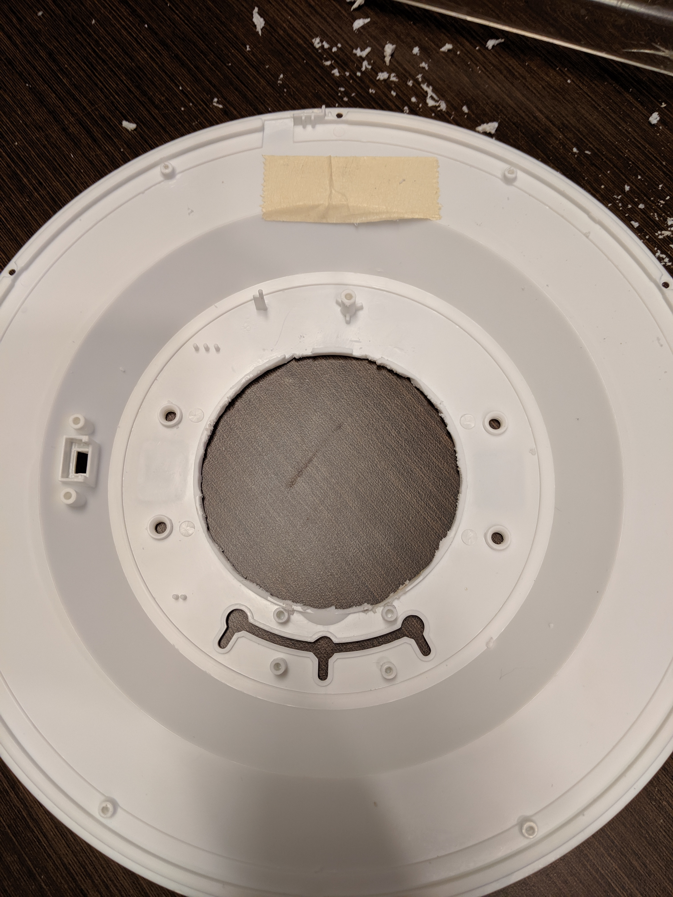
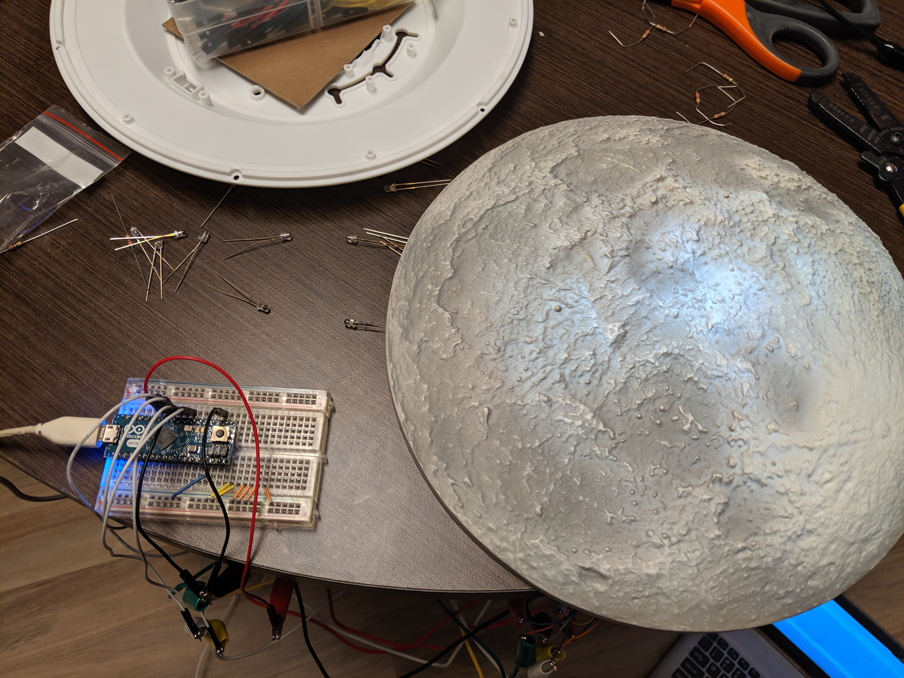
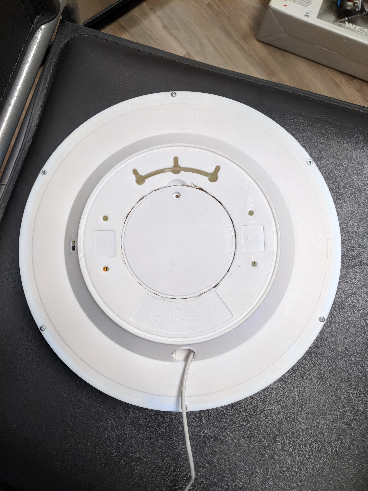

Moon In My Room Conversion
==========================

The goal of this project was to convert a Moon In My Room to show the current moon phase.
The solution involved both hardware and software changes.

How To Use
----------

Once you have the Moon converted and plugged in, there are several settings you can adjust.
You are able to adjust the brightness, speed, offset, direction, and smoothness.

To change a setting, press the button once, then keep pressing to cycle through the different settings.
When you first switch to an option, a short animation will play that represents what type of setting will be effected.
When you've gotten to the setting you want, wait 2 seconds, then you can make any adjustments.
Once you are done adjusting, wait 2 seconds, then the moon will revert back to displaying.
While adjusting, you can either keep pressing to adjust, or hold the button down to have a change trigger every .75 seconds.

The brightness controls the brightness of the display.
The current brightness will be shown while you are adjusting.
It is possible to set the brightness to 0 so it appears off.
The brightness does not affect the brightness while you are changing settings.

The speed controls how long a period is, from full moon to full moon.
There are 6 options: 12 seconds, 12 minutes, 1 hour, 1 day, 12 days, 1 full moon cycle (29 days, 12 hours, 44 minutes, and 3 seconds).
Your current speed is shown by which LED is lit up.
The smallest period is on the left and the largest is on the right.

The offset controls how far off the base state to be from when it was first plugged in.
There are 2 modes for this.
The first is for the full moon period.
An offset of 0 is a full moon.
Each time you trigger an offset, it is like you move forward 1 day.
For all other periods, triggering an offset moves forward one panel.

The direction controls what direction the panels light up.
By default, it lights up right to left, like the northern hemisphere.
With this setting you can choose to have it light up left to right also.

The smoothness controls whether there are smooth transitions between states.
By default, it makes smooth transitions.
You can make it do an instant transition if you prefer with this setting.

How It's Made
-------------

Below, I've documented the steps I went through in order to convert the Moon In My Room to use an arduino.

#### Materials

 * 1 Moon In My Room
 * 1 Arduino micro
 * 1 micro USB cable
 * 2 feet thin gauge wire
 * 1 protoboard
 * 1 push button
 * 1 10kOhm resistor
 * 1 piece of chip board

#### Tools

 * Phillips screwdriver
 * Soldering iron
 * Dremel with cutting wheel
 * Wire stripper/cutter

#### Procedure

The first step is deconstructing the moon.
I removed the batteries, then the front cover, then separated the front from the back panel.
Next was to remove the unnecessary electronics.
All I left was the circuit board attached to the LEDs and the wires coming from them.

You can see the back panel here:

And the remaining electronics here:

There is only a small amount of room in between the front and back panel, and most of it was taken up by the battery pack.
I used a dremel with a cutting wheel to cut out the battery area so I had more room to work with.
To make it a little nicer I also sanded it down after cutting it.

To make that space usable again, I cut out some chip board to cover where the hole was.
You could just as easily use cardboard too, I just had the chip board on hand.
I used super glue to keep it down, though a hot glue gun is probably a better choice.

The battery cover happened to fit back in the hole I made quite nicely, so I glued that on so the final product looked semi professional.

Next it was time to put some electronics back in.
I chose the arduino micro because it is so small and also because it was easy to solder to a protoboard.
I had to trim the ICSP pins to make it fit, but I don't plan on using them and if I need to I can solder new pins on.

The next step was to hook everything up with a breadboard as a proof of concept.

With that working, it was time to solder it all up.
From left to right, I hooked up the LEDs to pins 3, 5, 6, 9, 10, and 11.
I chose those ones because they are PWM pins, so I could create gradient effects.
I also hooked the button up with a pull down circuit, connected to pin 8 for input.

One final adjustment to the moon case was adding a hole for the USB cable.
I had considered keeping it on battery power, but I need it to last for months or years a time, which it wouldn't.
I just used the dremel again and cut a hole in the bottom.

Rather than cut another hole for the button, I stuck it where the switch originally was and glued it down.

Last, but not least, was reassembly.
I didn't tape or glue down the protoboard so I could potentially work on it in the future.
It also was staying pretty still with all the wires attached to it.
Quick note, upload the program before closing the case.
There is a chance when uploading that you need to press the reset button, which is hard to reach when you close everything up.
Not that I know from personal experience or anything.

Here's a nice view from the back.

And here's the money shot.

The rest from there is just putting it up on a wall and changing the settings to what you want.
This was a really fun little project that is relatively low cost and not too hard to finish in a day.
